# react-conspect

My own and awful conspect on react. Do not read this if you want to keep your mental health safe.

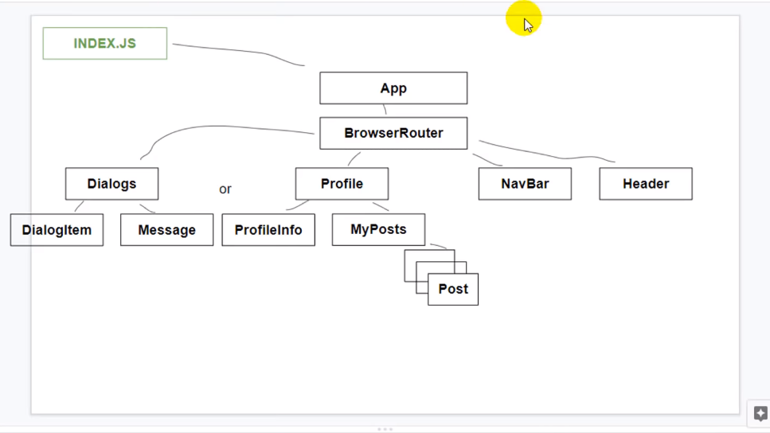

# Нельзя взаимодействовать с DOM напрямую

в React нельзя напрямую обращаться к DOM, вешать события и тд. Для этого есть VirtualDOM

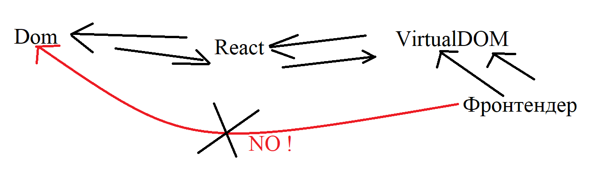

```JSX
document.getElementById, addEventListener //нельзя
```

такие взаимодействия делать нельзя, т.к. мы не знаем текущее состояние DOM дерева, ведь оно динамеческое.

Можно обращаться к элементам по ссылке `ref` хотя и это не рекомендуется. Для этого существует метод

```JSX
React.createRef()
```

Этот метод создает ссылку на элемент, по которой позже можно к нему обращаться.

## Как использовать

Помещаем метод в переменную

```JSX
let newDiv = React.createRef();
```

У элемента добавляем атрибут `ref={}` с переменной внутри

```JSX
<div ref={ newDiv }>
  Some text
</div>
```

теперь в `newDiv` хранится ссылка на элемент `<div></div>`

после метода добавляем `current`, что бы считывать элемент который хранится по ссылке
`newDiv.current.innerHTML`

## Пример

```javascript
let newDiv = React.createRef();

<div ref={newDiv}>Some text</div>;

let printText = () => {
  const text = newDiv.current.innerHTML;
  console.log(text);
};
```

## Но и так поступать не слудует

По этой ссылке мы все равно получаем доступ к DOM элементу(хоть только и для чтения), а т.к. мы используем React то нам нужно обращаться к VirtualDOM


## Изменения и ререндер

Что бы добавлять изменения произошедшие на странице в разметку(например добавление нового поста, или сообщения) нам нужно сначала добавить эти изменения в место хранения наших данных, BLL(Bussines logic layaer)

Для этого там нужно хранить функцию которая будет добавлять поступившие данные в уже имющиеся.

```javascript
export let addPost = (postMessage) => {
  let post = {
    id: 5,
    text: postMessage,
    value: 2,
  };

  state.profilePage.postsData.push(post); // добавляем объект в state
};
```

Создаем переменную для хранения ссылки на элемент, данные которого будем добавлять. Объявляем колбэк функцию, которая будет вызывать нашу функцию добавляющую объект в state.

```javascript
let newPost = React.createRef();

let printPost = () => {
  let post = newPost.current.value;
  props.addPost(post);
};
```

Вызываем колбэк по клику на кнопку.

```html
<textarea ref="{newPost}"></textarea>
<button onClick="{" printPost } className="{classes.button}">Add post</button>
```

Но тут у нас может возникать проблема
В state уже будут новые данные, но в разметке они не отобразятся.
Все дело в рендере

```JSX
ReactDOM.render(
  <React.StrictMode>
    <App state={state} addPost={addPost}/>
  </React.StrictMode>,
  document.getElementById('root')
);
```

Приложение у нас рендерится единожды, с имеющимеся на этот момент данными в `state`, что бы передать внутрь приложения через `props` новый `state` нам нужно заного вызвать рендер всего приложения.

Так же данные могут обновляться при перекличение по `<NavLink>`.

У `<Route />` есть атрибут: `render={() => <Component />}`

Когда route видит совпадение путей в адресной строке, он заного рендерит компонент с новым `state`.

## 33) Взаимодействие BLL(state/Redux) и UI(React)

Важно понимать, что данные нужно хранить в state и новые данные так же.

UI должен только рендерить данные которые ему прилетают.

Например, у нас есть кнопка добавляющая новый пост. По клику на кнопку, не UI должен пушить новые данные в `state`, а BLL.

После клика, UI вызывает колбек, который вызывают функцию находящуюся в `state`,
эта функция добавляет новый пост в `state`, и далее `state` заного вызывает рендер, с новыми данными

Схематично:

```javascript
BLL => Render => Click(event) => UI func(new data) => BLL func(push data) => BLL (new state) => Render
```

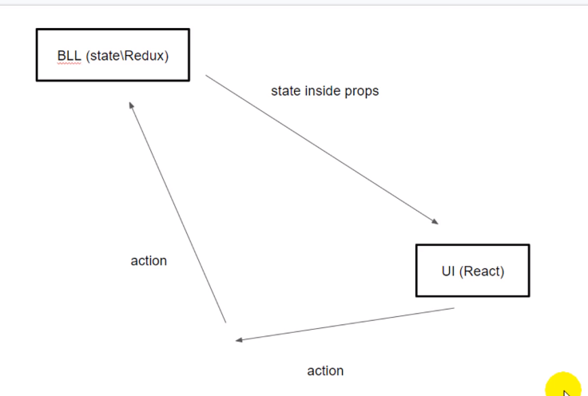

# 34 FLUX-круговорот

В архитектуре приложения должно быть разделение на UI(view - MVC) и Логику(BLL(Model - MVC))

Концептуально `UI` не должен изменять сам себя, это может происходить только через `BLL`.

Рассмотрим концептуальную задачу.
У нас есть `<textarea>` из который мы должны передавать данные, для дальнейшего переиспользования. Уже знакомое нам добавление нового поста

```JSX
  <textarea ref={newPost}></textarea>
  <button onClick={ printPost } className={classes.button}> Add post</button>
```

Вроде кажется что тут все в порядке, вводим текст в поле, жмем по кнопке и все прекрасно, пост добавился.
Но здесь есть важный аспект, наш `UI` изменяется напрямую, самим собой, в обход Логики (`BLL`):


Когда мы набираем текст он сразу же отображается в текстовом поле.
Это концептуальный пример для объяснения.
По хорошему такого не должно происходить.
Те изменения текста которые мы видим(`view`) в `UI` они не проходят через Логику(`'state.js' / BLL`). `UI` меняет сам себя.
Такого нужно избегать.
Что получается, нам нельзя отображать текст который мы вводим в текстовом поле? Почти, что да.
Нам нужно что бы каждое изменение сначала отправлялось сначала в `state/BLL/MODEL`, а оттуда уже эти данные отображались в текстовом окне.

## Пример

С этим концептуальным примером мы можем реализовать это так:

`Пользователь ввел символ(Он еще не виден в текстовом поле) => Символ отправился в state => Из стейта символ попадает в UI и отображается`

Для этого добавим EventListener для `<textarea>`, который будет выполняться на каждом изменении:

```HTML
let onAreaChange = () => {

}

<textarea onChange={onAreaChange}>
```

Так же мы должны как-то брать значения из этого поля, для передачи в Логику. Добавим value:

```html
<textarea onChange={onAreaChange} value={props.newAreaText}>
```

Теперь в значении этого поля хранится `newAreaText`, но что это такое?
Это атрибут который мы должны прокидывать из `state.js/BLL/Логика` в это текстовое поле. Но в `state.js` еще нет этого объекта, поэтому создадим его там

```javascript
//state.js
profilePage: {
  postsData: {...},
  newAreaText: "text area value"
};
```

После того как мы прокидаем этот объект через propsы в `<textarea>`
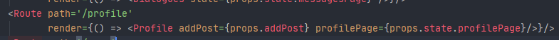
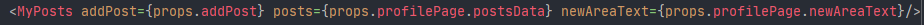

В `<textarea>` будет постоянно новое знанчение

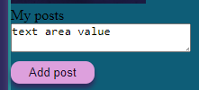

Теперь нам нужно изменять этот value при каждом вводе символа в поле, хранить в этом value введенный символ, и отображать обновленое поле ввода
Для начала добавим функцию в `state.js` которая будет добавлять, новые символы в `newAreaText`:

```JSX
//state.js

export let updateNewAreaText = (newSymbol) => {
  state.profilePage.newAreaText = newSymbol
  rerenderEntireTree(state) // не забываем перерендырить компоненты с новыми значениями
}
// newSymbol - вводимые символы в текстовом поле
```

Передадим ее через пропсы в нужный нам компонент.
Теперь ее нужно будет вызывать при изменениях.
Мы помним об обхявленной ранее функции `let onAreaChange = () => {}`

Эта функция вызывается при изменения `<textarea>`, теперь в нее мы положим вызов функции `updateNewAreaText` из `state.js`

```javascript
let onAreaChange = () => {
  let newText = newPost.current.value;
  updateNewAreaText(newText);
};
```

Теперь функция `updateNewAreaText` будет вызываться при вводе данных в текстовое поле, отправлять их в `state.js`, и рендерить `<textarea>` с новыми данным, без обхода `state.js`

И вот таким образом мы не позволяем UI(React) изменяться без участия BLL(Redux/state.js). Примерно такой архитектурной концепции должно придерживаться приложение, все данные берутся из одного места, `state.js`, UI может получать эти данные только от BLL и рендерить.


# 35 Избавление от циклической зависимости // callback observe

Сейчас в нашем проекте присутсвует циклическая зависимост.
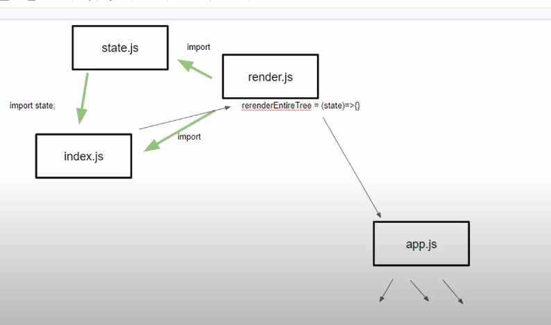
Мы добавляли `render.js` что бы `state.js` и `index.js` не импортировали друг из друга сущности, т.к. это плохая практика.
Но сложилось так что мы все же попали в циклическую зависимость.
`render.js` все же импортирует функции из `state.js`.

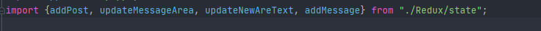
Как это можно исправить?

## callback observer

Для этого мы попробуем передавать функцию рендера в `state.js` через колбэк. Для начала объявим новую функцию в `state.js`

```javascript
ler rerenderEntireTree = () => {
  console.log('placeholder') // Пока функция ничего не выполняет
}
```

Следующим шагом мы объявляем еще одну функцию в `state.js` и экспортируем ее:

```javascript
export let subscribe = (observer) => {
  rerenderEntireTree = observer;
};
```

Эта функция будет присваивать значение ререндеру.

Теперь переходим к файлу `index.js`
Сначала копируем нашу функцию ререндера из `render.js` в `index.js`;

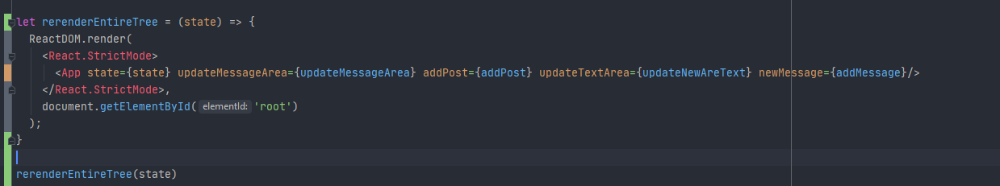
Файл `render.js` нам больше не понадобиться.

Теперь в файл `index.js` мы экпортируем наш колбэк `subscribe`

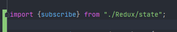

И вызываем `subscribe` после рендера

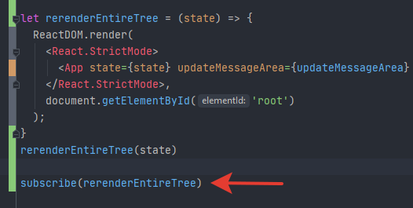

## Что тут происходит

Теперь файл `state.js` ничего не импортирует, только `index.js` импортирует из state.
При первом открытии страницы у нас выполняется ренденр всех компонентов в `index.js`. Вызывается `subscribe` с функцией рендера в аргументе.
Выполняясь `subscribe` записывает функцию рендера в `rerenderEntireTree()` в файле `state.js`

Теперь в объявленной в файле `state.js` `rerenderEntireTree` функции лежит функция рендера из `index.js` файла.

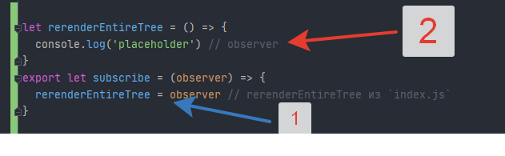

Есть несколько реазилаций стейт менеджмента


# **НУЖНО РАСПИСАТЬ:**

1. NodeJS
2. SPA
3. Функциональная компонента
   - Presentational презентационная
   - Statless без состояния
   - Тупая(dumb)
4. props
5. map
6. Route
7. UI - BLL(React Redux relativies)
8. Паттерн Observer
