# React-conspect

## My conspect on react learning course by "it-kamasutra". 
## **Do not read this if you want to keep your mental health safe ☠️🚑**


# ОСНОВЫ

## React компонент

Функциьнальная компонента - это функция принимающая на вход атрибут (`объект props`) и возращающая разметку `JSX`

```JSX
const Component = () => {
  return (
    <div>
      <h1> Hello, I'm a component </h1>
    </div>
  )
}
```

Эта разметка должна быть обернута единственным родителем, как например `<div></div>` выше.

Потом мы можем вызывать эту функцинальную компоненту, как функцию, по следующему синткасису

```JSX
<Component /> // Теперь в этом месте будет разметка JSX которую мы возращаем через компоненту
```

# Нельзя взаимодействовать с DOM напрямую

в React нельзя напрямую обращаться к DOM, вешать события и тд. Для этого есть VirtualDOM


```JSX
document.getElementById, addEventListener //нельзя
```

такие взаимодействия делать нельзя, т.к. мы не знаем текущее состояние DOM дерева, ведь оно динамеческое.

Можно обращаться к элементам по ссылке `ref` хотя и это не рекомендуется. Для этого существует метод

```JSX
React.createRef()
```

Этот метод создает ссылку на элемент, по которой позже можно к нему обращаться.

## Как использовать

Помещаем метод в переменную

```JSX
let newDiv = React.createRef();
```

У элемента добавляем атрибут `ref={}` с переменной внутри

```JSX
<div ref={ newDiv }>
  Some text
</div>
```

теперь в `newDiv` хранится ссылка на элемент `<div></div>`

после метода добавляем `current`, что бы считывать элемент который хранится по ссылке
`newDiv.current.innerHTML`

## Пример

```javascript
let newDiv = React.createRef();

<div ref={newDiv}>Some text</div>;

let printText = () => {
  const text = newDiv.current.innerHTML;
  console.log(text);
};
```

## Но и так поступать не слудует

По этой ссылке мы все равно получаем доступ к DOM элементу(хоть только и для чтения), а т.к. мы используем React то нам нужно обращаться к VirtualDOM


## Изменения и ререндер

Что бы добавлять изменения произошедшие на странице в разметку(например добавление нового поста, или сообщения) нам нужно сначала добавить эти изменения в место хранения наших данных, BLL(Bussines logic layaer)

Для этого там нужно хранить функцию которая будет добавлять поступившие данные в уже имющиеся.

```javascript
export let addPost = (postMessage) => {
  let post = {
    id: 5,
    text: postMessage,
    value: 2,
  };

  state.profilePage.postsData.push(post); // добавляем объект в state
};
```

Создаем переменную для хранения ссылки на элемент, данные которого будем добавлять. Объявляем колбэк функцию, которая будет вызывать нашу функцию добавляющую объект в state.

```javascript
let newPost = React.createRef();

let printPost = () => {
  let post = newPost.current.value;
  props.addPost(post);
};
```

Вызываем колбэк по клику на кнопку.

```html
<textarea ref="{newPost}"></textarea>
<button onClick="{" printPost } className="{classes.button}">Add post</button>
```

Но тут у нас может возникать проблема
В state уже будут новые данные, но в разметке они не отобразятся.
Все дело в рендере

```JSX
ReactDOM.render(
  <React.StrictMode>
    <App state={state} addPost={addPost}/>
  </React.StrictMode>,
  document.getElementById('root')
);
```

Приложение у нас рендерится единожды, с имеющимеся на этот момент данными в `state`, что бы передать внутрь приложения через `props` новый `state` нам нужно заного вызвать рендер всего приложения.

Так же данные могут обновляться при перекличение по `<NavLink>`.

У `<Route />` есть атрибут: `render={() => <Component />}`

Когда route видит совпадение путей в адресной строке, он заного рендерит компонент с новым `state`.

## 33 Взаимодействие BLL(state/Redux) и UI(React)

Важно понимать, что данные нужно хранить в state и новые данные так же.

UI должен только рендерить данные которые ему прилетают.

Например, у нас есть кнопка добавляющая новый пост. По клику на кнопку, не UI должен пушить новые данные в `state`, а BLL.

После клика, UI вызывает колбек, который вызывают функцию находящуюся в `state`,
эта функция добавляет новый пост в `state`, и далее `state` заного вызывает рендер, с новыми данными

Схематично:

```javascript
BLL => Render => Click(event) => UI func(new data) => BLL func(push data) => BLL (new state) => Render
```


# 34 FLUX-круговорот

В архитектуре приложения должно быть разделение на UI(view - MVC) и Логику(BLL(Model - MVC))

Концептуально `UI` не должен изменять сам себя, это может происходить только через `BLL`.

Рассмотрим концептуальную задачу.
У нас есть `<textarea>` из который мы должны передавать данные, для дальнейшего переиспользования. Уже знакомое нам добавление нового поста

```JSX
  <textarea ref={newPost}></textarea>
  <button onClick={ printPost } className={classes.button}> Add post</button>
```

Вроде кажется что тут все в порядке, вводим текст в поле, жмем по кнопке и все прекрасно, пост добавился.
Но здесь есть важный аспект, наш `UI` изменяется напрямую, самим собой, в обход Логики (`BLL`):


Когда мы набираем текст он сразу же отображается в текстовом поле.
Это концептуальный пример для объяснения.
По хорошему такого не должно происходить.
Те изменения текста которые мы видим(`view`) в `UI` они не проходят через Логику(`'state.js' / BLL`). `UI` меняет сам себя.
Такого нужно избегать.
Что получается, нам нельзя отображать текст который мы вводим в текстовом поле? Почти, что да.
Нам нужно что бы каждое изменение сначала отправлялось сначала в `state/BLL/MODEL`, а оттуда уже эти данные отображались в текстовом окне.

## Пример

С этим концептуальным примером мы можем реализовать это так:

`Пользователь ввел символ(Он еще не виден в текстовом поле) => Символ отправился в state => Из стейта символ попадает в UI и отображается`

Для этого добавим EventListener для `<textarea>`, который будет выполняться на каждом изменении:

```HTML
let onAreaChange = () => {

}

<textarea onChange={onAreaChange}>
```

Так же мы должны как-то брать значения из этого поля, для передачи в Логику. Добавим value:

```html
<textarea onChange={onAreaChange} value={props.newAreaText}>
```

Теперь в значении этого поля хранится `newAreaText`, но что это такое?
Это атрибут который мы должны прокидывать из `state.js/BLL/Логика` в это текстовое поле. Но в `state.js` еще нет этого объекта, поэтому создадим его там

```javascript
//state.js
profilePage: {
  postsData: {...},
  newAreaText: "text area value"
};
```

После того как мы прокидаем этот объект через propsы в `<textarea>`


В `<textarea>` будет постоянно новое знанчение


Теперь нам нужно изменять этот value при каждом вводе символа в поле, хранить в этом value введенный символ, и отображать обновленое поле ввода
Для начала добавим функцию в `state.js` которая будет добавлять, новые символы в `newAreaText`:

```JSX
//state.js

export let updateNewAreaText = (newSymbol) => {
  state.profilePage.newAreaText = newSymbol
  rerenderEntireTree(state) // не забываем перерендырить компоненты с новыми значениями
}
// newSymbol - вводимые символы в текстовом поле
```

Передадим ее через пропсы в нужный нам компонент.
Теперь ее нужно будет вызывать при изменениях.
Мы помним об обхявленной ранее функции `let onAreaChange = () => {}`

Эта функция вызывается при изменения `<textarea>`, теперь в нее мы положим вызов функции `updateNewAreaText` из `state.js`

```javascript
let onAreaChange = () => {
  let newText = newPost.current.value;
  updateNewAreaText(newText);
};
```

Теперь функция `updateNewAreaText` будет вызываться при вводе данных в текстовое поле, отправлять их в `state.js`, и рендерить `<textarea>` с новыми данным, без обхода `state.js`

И вот таким образом мы не позволяем UI(React) изменяться без участия BLL(Redux/state.js). Примерно такой архитектурной концепции должно придерживаться приложение, все данные берутся из одного места, `state.js`, UI может получать эти данные только от BLL и рендерить.


# 35 Избавление от циклической зависимости // callback observe

Сейчас в нашем проекте присутсвует циклическая зависимост.

Мы добавляли `render.js` что бы `state.js` и `index.js` не импортировали друг из друга сущности, т.к. это плохая практика.
Но сложилось так что мы все же попали в циклическую зависимость.
`render.js` все же импортирует функции из `state.js`.

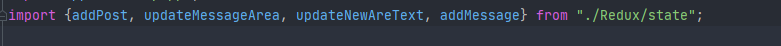
Как это можно исправить?

## callback observer

Для этого мы попробуем передавать функцию рендера в `state.js` через колбэк. Для начала объявим новую функцию в `state.js`

```javascript
ler rerenderEntireTree = () => {
  console.log('placeholder') // Пока функция ничего не выполняет
}
```

Следующим шагом мы объявляем еще одну функцию в `state.js` и экспортируем ее:

```javascript
export let subscribe = (observer) => {
  rerenderEntireTree = observer;
};
```

Эта функция будет присваивать значение ререндеру.

Теперь переходим к файлу `index.js`
Сначала копируем нашу функцию ререндера из `render.js` в `index.js`;


Файл `render.js` нам больше не понадобиться.

Теперь в файл `index.js` мы экпортируем наш колбэк `subscribe`


И вызываем `subscribe` после рендера


## Что тут происходит

Теперь файл `state.js` ничего не импортирует, только `index.js` импортирует из state.
При первом открытии страницы у нас выполняется ренденр всех компонентов в `index.js`. Вызывается `subscribe` с функцией рендера в аргументе.
Выполняясь `subscribe` записывает функцию рендера в `rerenderEntireTree()` в файле `state.js`

Теперь в объявленной в файле `state.js` `rerenderEntireTree` функции лежит функция рендера из `index.js` файла.

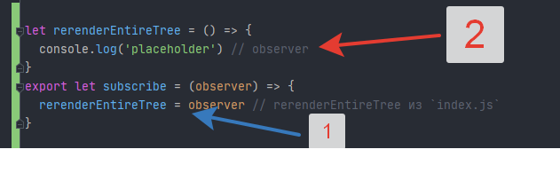

# 36 про ООП поверхностно

Инкапсуляция - скорытие деталей от внешнеего мира
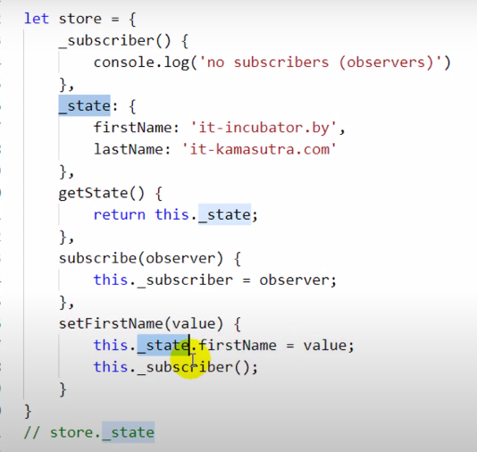
Объект store с методами, геттерами сеттерами
методы инкапсулированы


Пример использования объекта store.
Есть несколько реазилаций стейт менеджмента


# 38 dispatch

Мы организовали state managment через файл `store.js` в котором глобальный объект `store`
В нем хранятся методы и данные которые мы используем.
Этих методов может быть много, у нас уже есть:

```javascript
addPost()
addMessage()
getState()
updateNewPostText()
и тд...
```

Что бы их использовать нам приходится всех их прокидывать через пропсы
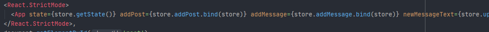
Для сокращения кол-ва передаваемых методов мы будем использовать один метод: `dispatch()`
Он будет вызываться когда нам нужно будет что-то выполнить в компоненте

```javascript
dispatch () {

}
```

Но как он будет узнавать что именно мы хотим сделать? Для этого аргументом у этого метода будет `объект - action` и
этот объект будет описывать какое действие метод должен совершить. Так же у этого объекта должно быть свойство `type` с текстовым значением, в котором будет записано действие которое он должен совершить, записывать это действие надо в верхнем регистре
Например наш метод `addPost()`

```javascript
  { //action
    type: "ADD-POST",
}

```

```javascript
dispatch (action) {

}
```

Теперь добавим действия которые должен будет выполнять этот метод

```javascript
dispatch (action) {
  if(action.type === 'ADD-POST') {
    //наш метод addPost
      let newPost = {
      id: 5,
      text: this._state.profilePage.newPostText
      value: 2
    }
  this._state.profilePage.postsData.push(newPost)
  this._callSubscriber(this._state)
  } else if (action.type === "UPDATE-NEW-AREA-TEXt") {
    // Мы добавили и другой наш метод
    this._state.profilePage.newAreaText = action.newSymbol;
    this._callSubscriber(this._state)
  }
}
```

Кроме `type` иногда нам придется добавлять и другие значения, как во втором случае `newSymbol == символы которые мы вводили в поле ввода`

Нужно теперь заменить наши методы в пропсах на один метод dispatch, не забываем его забайндить, что бы этот метод вызывался не для объекта `props` а для нашего объекта `store`.

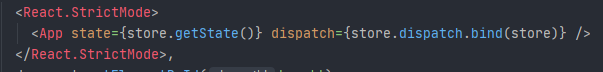
Проделываем такое дальше по дереву компонентов, но уже без `bind` т.к. мы один раз забайндили метод `dispatch` к объекту `store` и теперь он будет принадлежать ему

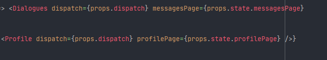
=>

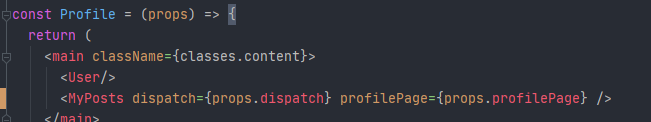

Осталось только внести изменения в компонентах вызывающих наши старые методы

Меняем эти методы на `dispatch` с аргументом в виде объекта с необходимыми нам ключами

Было

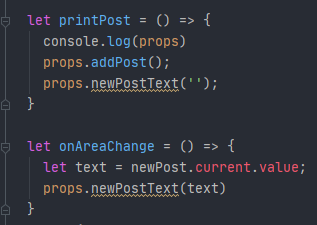

Стало

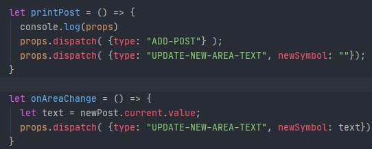

Теперь мы выполняем нужно нам действие через один метод, просто изменяя поля передаваемого в него объекта.
Таким образом мы сократили кол-во передаваемых в пропсах методах, и еще больше отделили компоненты от логики.

# 39 action creator, action type

В методе диспатч мы используем объект `action`, но значения которые мы передаем в этот объект мы пишем руками, хардкодим, есть вероятность мистпайпинга, так же мы `action` формируем в `UI`, но он не должен этим заниматься, компоненты реакта должны только рендерить и ждать действий пользователя. Все логические операции нужно стараться переносить в `BLL`, а у нас получается что мы в `UI` формируем `action` объект.
Нужно это исправить и зарефакторить код

Добавим переменные для `action` в Стейте.
Строковые значения свойства `type` нашего `action` будем хранить в неизменяемых переменных, что бы исключить мистайпинг

```javascript
const ADD_POST = "ADD-POST";
const UPDATE_NEW_AREA_TEXT = "UPDATE-NEW-AREA-TEXT";
```

Теперь создадим и сразу же экспортируем функции которые будут возращать объект `action`

```javascript
const addPostActionCreator = () => {
  return {
    type: ADD_POST,
  };
};
```

Нам не нужно передавать в функцию переменную `ADD_POST` это неизменяемая переменная, доступная по области видимости. Так же немного зарефакторим функцию.
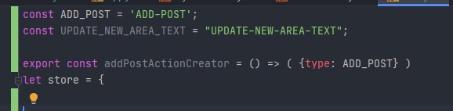

Тот же код но минифицирован немного.

Осталось ипортировать эти функции в месте применения
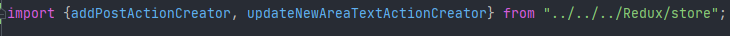

И вызывать `dispatch` с аргументом в виде этих функций

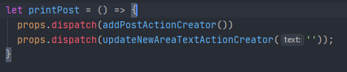

# 41 reducer

Если сейчас взглянуть на метод `dispatch`
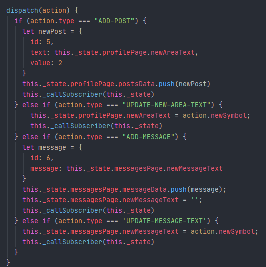

Можно увидеть много логики в одной функции, а если добавлять новые `action` то `dispatch` разрастется до больших размеров. Такое поведение плохо. Нам нужно раздробить `dispatch` на много мелких функций.

Так выглядит сейчас наш **State**

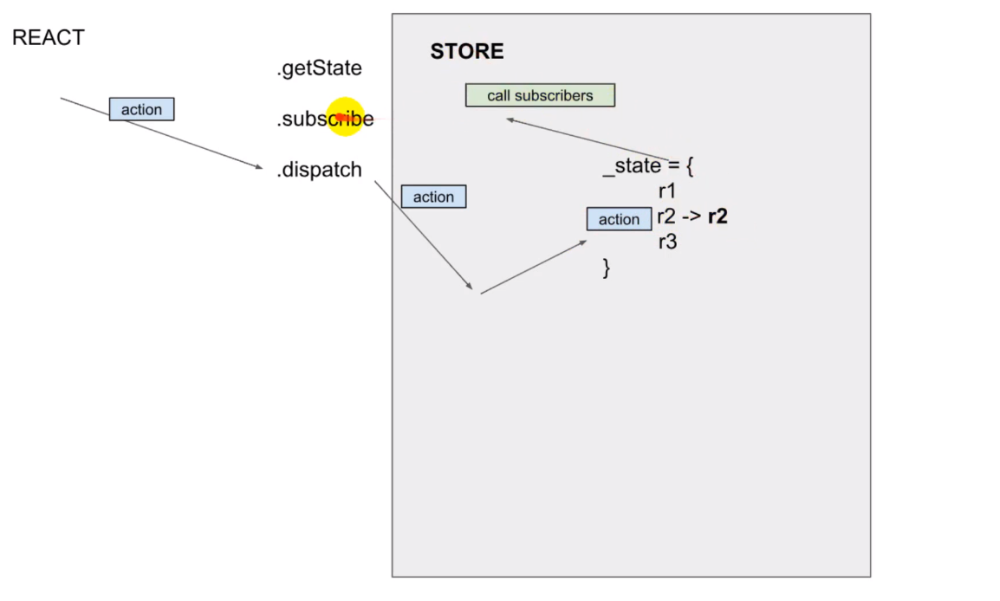
**UI** вызывает `dispatch` передавая в него `action` и оттуда `dispatch` изменяет **State**, много логики для одной функции.

Мы раздробим `dispatch` на более мелкие функции `reducer`
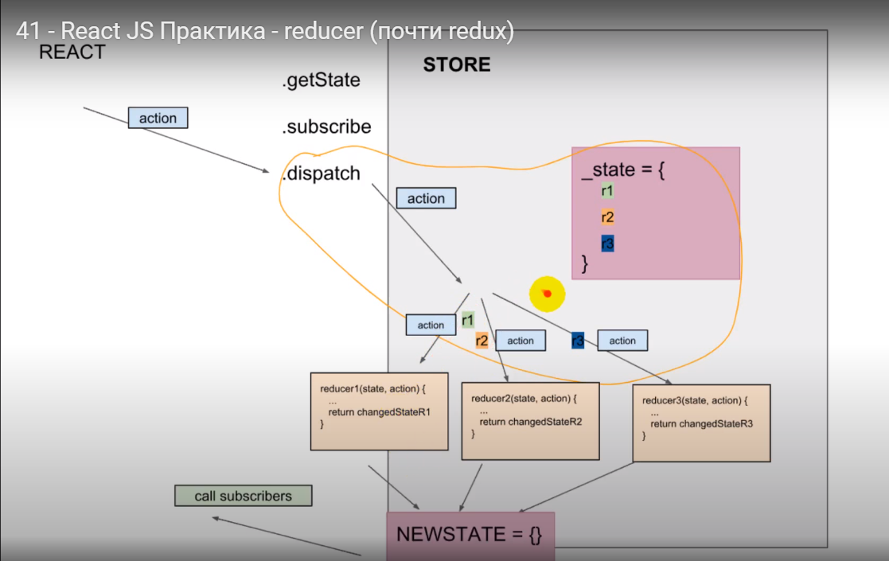
Каждая функция будет изменять только часть **State** за которую она отвественна, потом **State** будет обновляться и из собранных данных из всех `reducer` функций.

## Создаем reducer

В директории со **State** создаем новые файлы

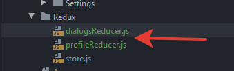

Кол-во и имена этих файлов соотвествует кол-ву веток в нашем `store._state` (у меня опечатка, файл dialogsReducer должен называться messagesReducer)

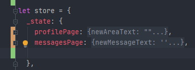

и объявляем в этих файлах функции в соответвествии с именем файла

```javascript
const profileReducer = (state, action) => {
  return state;
};
```

эти функции принимают знакомые уже `action` и `state` и возращают `state`

Теперь копируем код из `dispatch` в соотвествии с профилем `reducer` и константы для `action`, и переносим их в `reducer`

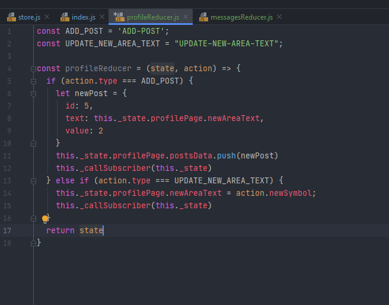

Зарефакторим этот код

Изменим `this._state.profile...` на `state` т.к. в этом аргументе и будет лежать необходимый для этого `reducer`'a **State**. Так же уберем `this._callSubscriber` мы не должны ререндерить в редьюсере, мы это будем делать в `dispatch` и не забываем экспортировать эти функции.
Нужно внимательно экспортировать, я вызвал функцию при экспорте и у меня все было плохо :(

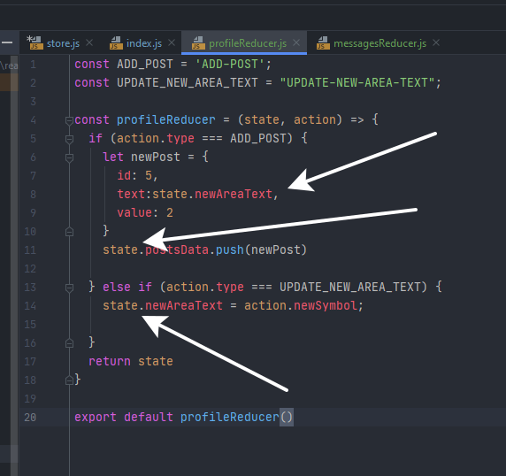

Импортируем их и вызываем в `dispatch`.
При каждом вызове диспатч в **UI** наш стейт будет обновляться

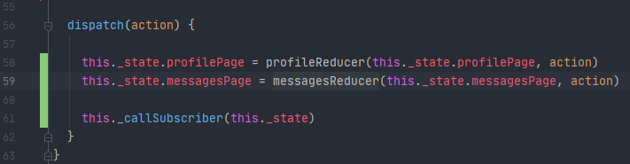

# 43 Container Component

Вернемся к **UI**. Если взглянуть на структуру нашего приложения то видно что компоненты все еще имеют достаточно доступа к **STATE**

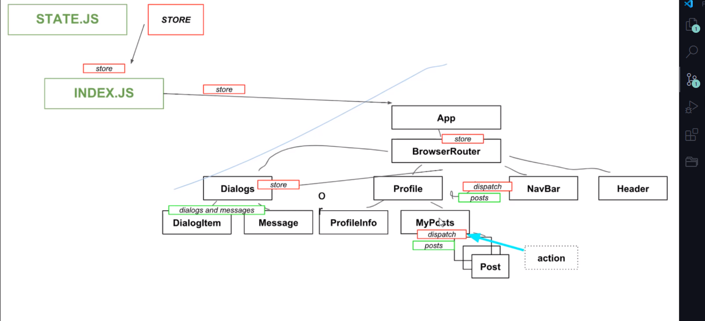

Можно рассмотреть ближе компоненту `<MyPosts />`

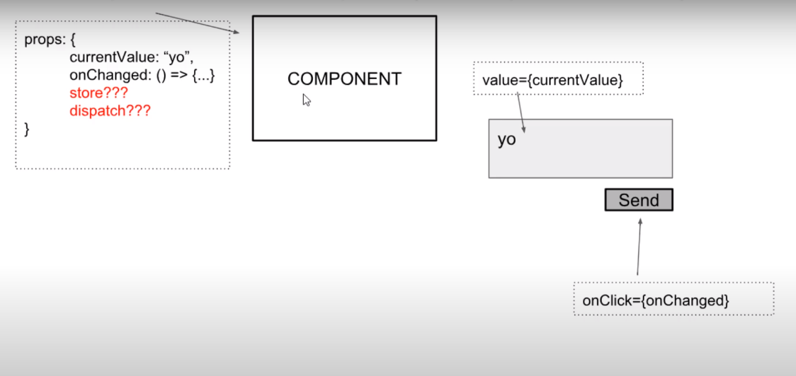

Как видно у нее есть доступ к `store` и `dispatch`, это не совсем хорошо.

Вот как она выглядит в коде

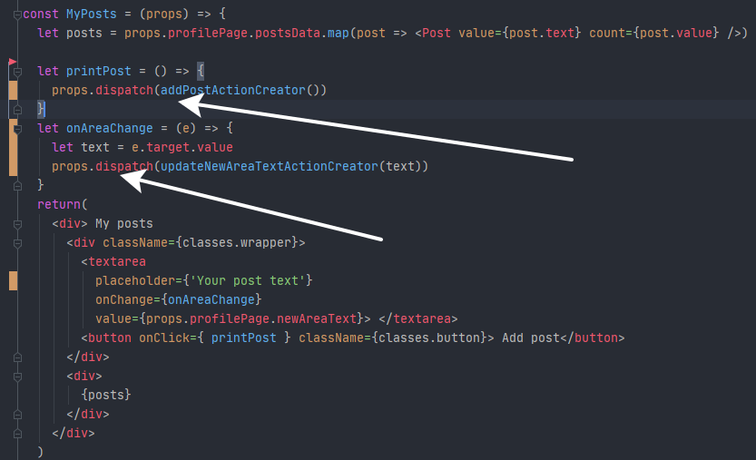

Нужно эту компоненту еще сильнее "отупить", что бы она не могла напрямую взаимодейстовать со **STATE**

В такой ситуации можно эту компоненту сделать репрезентационной и обернуть ее компонентой контейнером

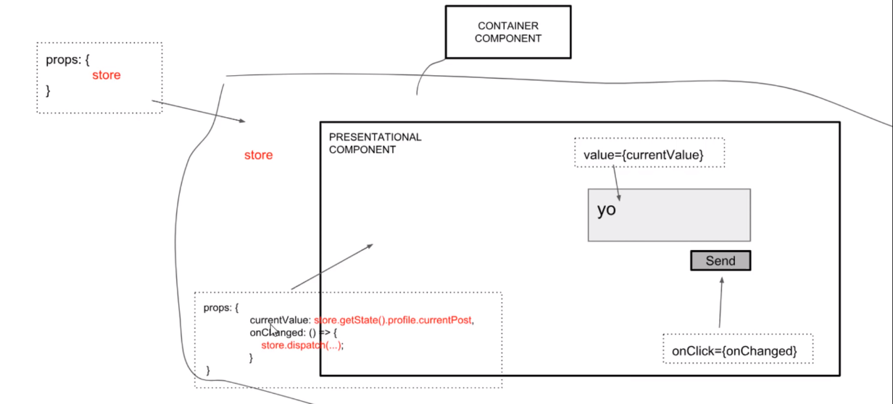

В репрезентационной компоненте мы оставим только вызовы функий по событиям, эти функции не будут взаимодействовать со **STATE**
Все эти взаимодействия и передачи текущего состояния **STATE** возьмет на себя Компонента контейнер

Вот как это реализуем:
`Создадим новый файл MyPostContainer.jsx => перенесем в него dispatch => Репрезентационная компонента будет только выполнять импортированные из Контейнерной компоненты функции, например dispatch`

В этой же директории создаем файл `MyPostsContainer`, и копируем в него код из `MyPost.jsx`(репрезентационной компоненты)
Начнем удалять все не нужное нам из компоненты контейнера и порефакторим функции которые будем передавать в `MyPost`, и сразу же передадим их через `props`.

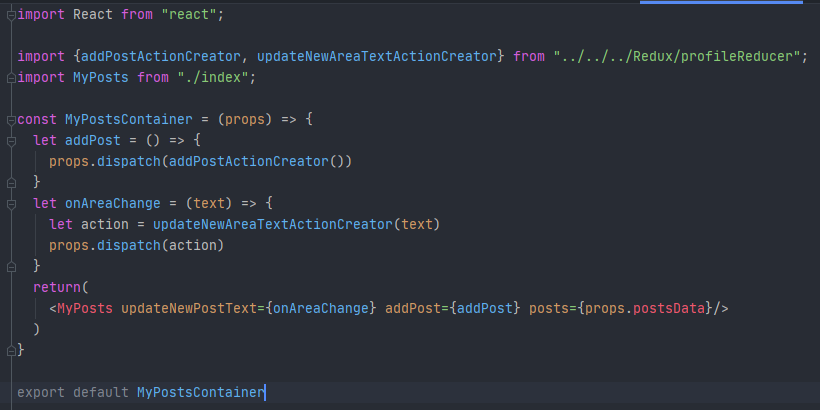

и эти колбеки и пропсы будем ожидать в компоненте `MyPost`

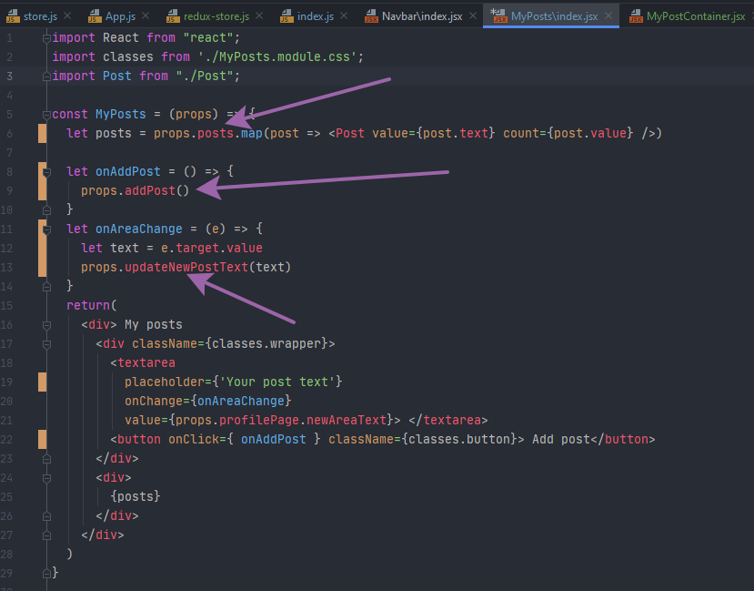

Зачем мы все это проделали. Теперь у нас компонента `MyPost` читстая и может только показывать изменения **STATE** и сообщать о новых данных Компоненте обертке. Компонента обертка `MyPostContainer` можно сказать "грязная", она снабжает репрезентационную необходимыми ей данными, забирает из нее данные и обращается к **STATE** что бы тот забрал новые данные.

# 44 React Context

В React пропсы передаются сверху вниз, от родителя к дочернему элементу, это может приводить к дополнительной работе с пропсами и прокидыванием их по дереву, если нам нужно использовать эти пропсы только в определенном вложенном глубоко компоненте

Пример:
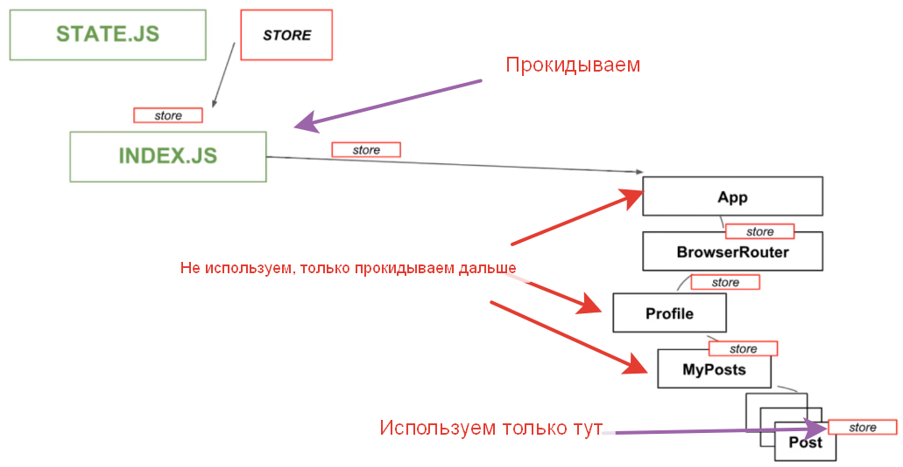

У нас есть возможность избегать такого, благодаря контексту.
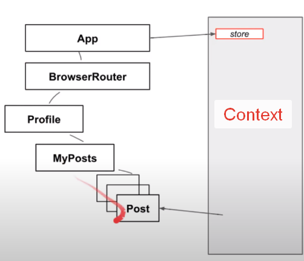

Нет небходимости прокидывать props до компонента Post, он может брать их из Контекста. Может появится желание вообще перестать прокидывать пропсы, и использовать только контекст, но этого делать не нужно.
Контекст можно воспрнимать как глобальную область видимости, хранить там что-то важное не стоит. Можно например передавать так цветовую тему приложения, текущий язык и т.п. то есть, то что не всем компонентам по дереву нужно.

Что бы создать контекст нужно объявить переменную с объявлением контекста

```javascript
const MyContext = React.createContext();
```

Далее компонент для которого мы создаем контекст нужно обернуть компонентом Провайдером(`имя_переменной.Provider`) в котором мы будет хранить нужное нам в контексте значение

```HTML
<MyContext.Provider value={ store }>
  <App />
<MyContext.Provider>
```

Что бы обращаться к контексту, нам необходим компонент Потребитель, с функцией возращающей разметку, в качестве атрибута использующая то что мы передали в контекст:

```HTML
<MyContext.Consumer>
  {
    (store) => {
      return (
        <Post addPost={store.profilePage} /> // обращаемся к store и берем нужное нам
      )
    }
  }
<MyContext.Consumer>
```

# 45 React-Redux / connect / mapStateToProps

До этого мы создавали Компонент Контейнер что бы им обернуть репрезентационный компонент

Сделать это так же можно более простым способом благодаря библиотеке React-Redux

```
 npm install react-redux --save
```

После того как билиотека установилась в файле с Компонентом Контейнером объявляем переменную в которой лежит функция
Для компоненты Dialogs, "обертка" будет такой:

```javascript
const DialogsContainer = connect()(Dialogs);
```

Вторые скобки означают что функция коннект возращает нам другую функцию
Туда мы передаем презентанционный компонент dialogs, в первом вызове мы снабжаем эту функцию данными(колбэки и состояние стейта) которые мы хотим передать презентационному компоненту.
Функция `connect` создаем Компонент Контейнер и внутри него Презентационный Компонент с props которые мы туда передадим

Все эти пропсы мы будет передавать через атрибуты в функции connect
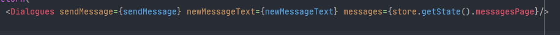

Для этого объявим две функции возращающие объект

```javascript
// Данные из Стейт
const mapToStateProps = (state) => {
  return {
    messages: state.mesagesPage
  }
}
// Передаем колбэки
const mapDispatchToProps = (dispatch) => {
  return {
    sendMessage: () => {
      dispatch(addMessageActionCreator())
    }
    newMessageText: () => {
      dispatch(updateMessageTextActionCreator(text))
    }
}
```

Эти функции будут атрибутами `conncet()`. Возникает вопрос откуда в этих двух функциях возьмутся атрибуты `state` и `dispatch`. Библиотека `react-redux` откуда мы взяли функцию `connect` передаст сама эти атрибуты

```javascript
const DialogsContainer = connect(mapToStateProps, mapDispatchToProps)(Dialogs);
```

сonst DialogsContainer = connect(mapToStateProps, mapToActionsProps)(Dialogs)
https://habr.com/ru/company/ruvds/blog/423157/

# 47

Чистые функции - функции с детерменированным поведением, результат функции зависит только от входных данных.

```
data1 => function => result1
data2 => function => result2
```

## Законспектить копирование и connect

# 54 Методы жизненного цикла

Функциональный компонент возращает JSX разметку, каждый раз когда его вызывают. Тут все просто

Классы действуют немного по другому.
Объявляются классы следующим образом:

```javascript
class Component extends React.Component {}
```

Что тут происходит?
Есть некий класс созданный библиотекой Реакт, у этого класса есть свои методы.
Когда мы объявляем новый Компонент, мы как бы расширяем этот Реакт класс, он становится прототипом Компонента.
По цепочке прототипного наследования, Копмонент наследует и методы класса Реакт.
Реакт использует Классовый компонент как посредника для получения JSX разметки.
Тот же метод для отрисовки, `render()`, наследуется от React.
Этот объект, находится в памяти, и с ним происходят различные жизненые циклы.
Во время рендера, `React` "обращается" к классовой компоненте и наследованному методу `render()`.
Одними из методов жизненого цикла являются:

```
componentDidMount()
```

```
componentDidUpdate()
```

И так после `render()` Компонент возращает JSX разметку, далее эту разметку нужно транспилировать в index.html, вставить в разметку html документа. Классовый Компонент не знает когда это произойдет, этим занимается `React`, Компонент только возращает JSX. Но Компоненту нужно знать когда JSX попадет в html, для этого и есть метод жизненого цикла
`componentDidMount()` _(перевод: Компонент был вмонтирован/установлен)_.

`React`, после размещения JSX в HTM, вызывает в Компоненте метод `componentDidMoun()` , и тем самы сообщает о произошедшем.
Жизненый цикл Компонента можно схематично обрисовать следующим образом.

`Component.render() => JSX to HTML => Component.componentDidMpunt()`

Зачем это? :)
`componentDidAmount()` подходит для операций с `side effect`'aми, например AJAX запросы.

# **НУЖНО РАСПИСАТЬ:**

1. NodeJS
2. SPA
3. Функциональная компонента
   - Presentational презентационная
   - Statless без состояния
   - Тупая(dumb)
4. props
5. map
6. Route / BrowserRouter / NavLink
7. UI - BLL(React Redux relativies)
8. Паттерн Observer
9. bind / Контекст вызова
10. Чистая функция / Детерменированость
11. Spread / Деструктуризация / Тернарные / Do while / for in
12. Сompose / HOC / THUNK / Async in React/Redux
